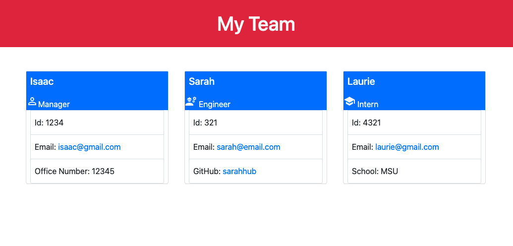

# Team-Profile_Generator

## Overview
  This project was designed as a homework assignment for my coding bootcamp. The goal was to build a Node.js command line application that takes in information about employees. 

  The webpage should display the team's basic info with quick access to their emails and GitHub profiles.

  ## Table of Contents
   - [Installation](#installation)
   - [Usage](#usage)
   - [Contributing](#contributing)
   - [Tests](#tests)
   - [Questions](#questions)

  ## Installation
   - Fork repository 
   - Access VS Code 
   - Download Node.js 
   - Npm init 
   - Install Inquirer, fs and jest.

  ## Usage
   - Run "node index"
   - Answer the prompted questions 
   - The README file will be generated and located in the "readme" folder.

   [Walkthrough video](https://watch.screencastify.com/v/YLlMBwhEMnBo2H6yMMx7)

   

  ## Contributing
   Isaaccna

  ## Tests
   [Walkthrough video](https://watch.screencastify.com/v/Dx1ipq2VFcuWGaTVSNQ1)   

  ## Questions
   For any questions about the project, please visit my:  
   GitHub Profile: [isaaccna](https://github.com/isaaccna)  
   or  
   Email: @ isaac.andrade1231@gmail.com